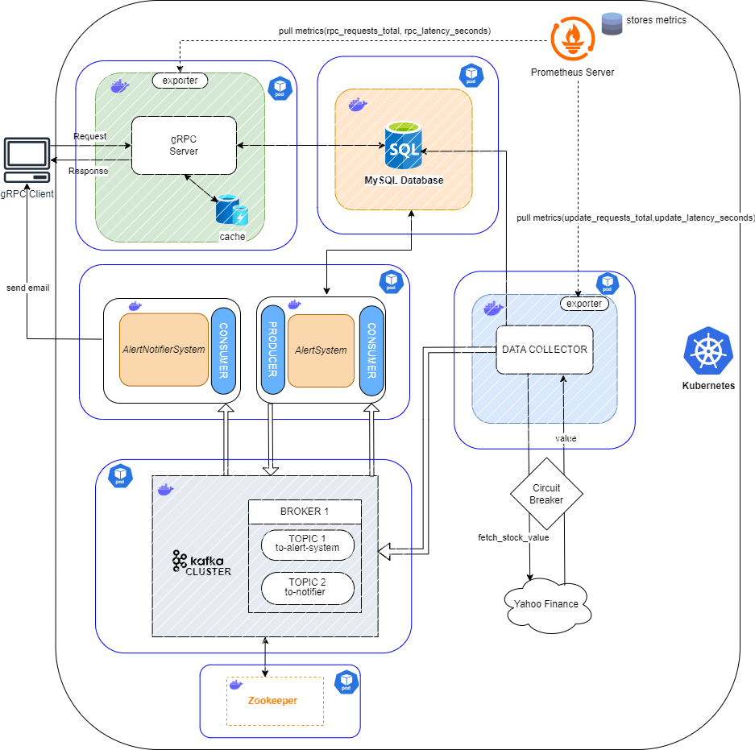

# RELAZIONE – HOMEWORK 3 - Prova in Itinere DSBD aa 2024-2025

**Studenti:**  
Bonafede Salvatore Luca (1000067612)  
Bontempo Gaetano (1000067613)

## ABSTRACT
Per l’Homework 3, il sistema sviluppato è stato esteso con nuove funzionalità, introducendo un meccanismo di white-box monitoring per raccogliere informazioni sulle performance di almeno due microservizi esistenti. Il sistema monitorato è stato deployato su una piattaforma Kubernetes integrando Prometheus come strumento per la raccolta delle metriche. 

## 1. MONITORAGGIO CON PROMETHEUS
È stato implementato un sistema di monitoraggio white-box utilizzando Prometheus, concentrandosi su due microservizi chiave: il server gRPC e il Data Collector.  
Per ogni microservizio è stato sviluppato un exporter Prometheus che espone endpoint HTTP per le metriche di tipo Gauge e Counter.
Ecco i microservizi soggetti al monitoraggio:

- **Server gRPC:**
  - `rpc_latency_seconds (GAUGE)` – Latenza dell'ultima chiamata RPC in secondi
  - `rpc_total_requests (COUNTER)` – Numero totale di richieste RPC ricevute

- **Data Collector:**
  - `data_update_latency_seconds (GAUGE)` – Latenza dell'operazione di Aggiornamento Dati in secondi
  - `data_total_updates (COUNTER)` – Numero totale di richieste di Aggiornamento Dati

## 2. Deployment su Kubernetes
Il sistema è stato distribuito su una piattaforma Kubernetes utilizzando manifest YAML per il deployment dei microservizi. 
Per testare e validare il sistema, è stato utilizzato un cluster locale Minikube. Quest'ultimo è uno strumento che consente di eseguire un cluster Kubernetes in locale, facilitando lo sviluppo di applicazioni containerizzate. Per esporre i servizi all'esterno del cluster, sono stati configurati Service di tipo NodePort. Un Service di tipo NodePort consente di aprire una porta specifica su ogni nodo del cluster, permettendo l'accesso ai servizi da indirizzi IP esterni. Questo approccio è utile in ambienti di sviluppo, poiché consente di accedere ai servizi senza la necessità di configurare un LoadBalancer.

## 3. Diagramma Architetturale
Di seguito è riportato un diagramma che illustra i micro-servizi coinvolti e le loro interazioni:

